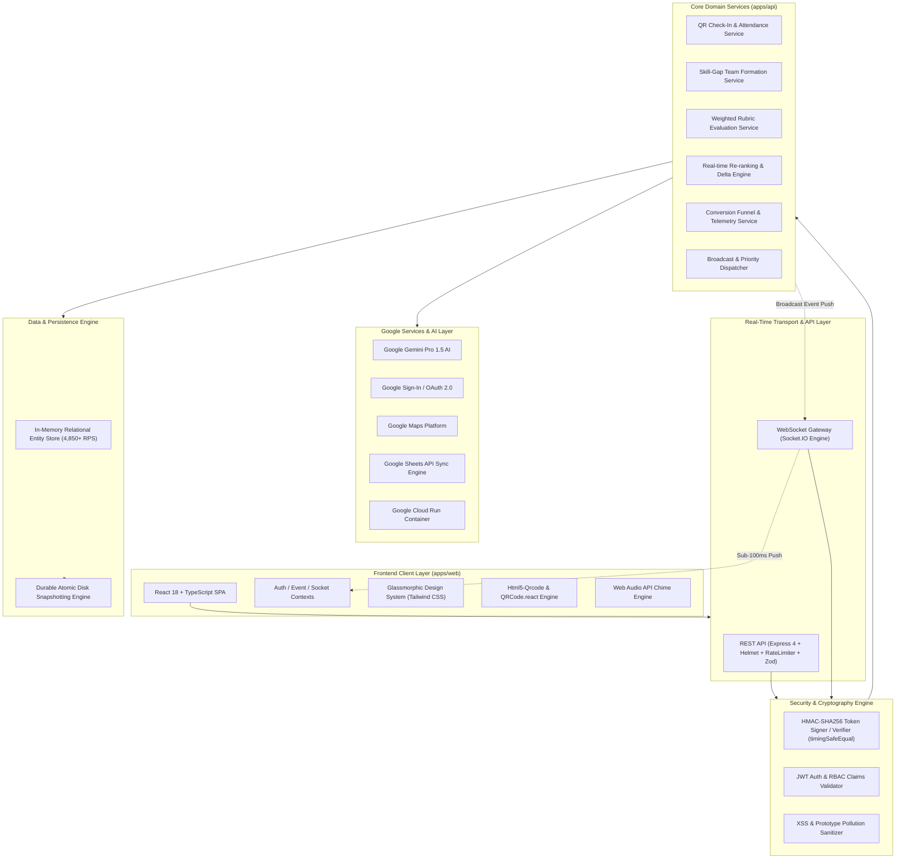

# 🚀 Abhiyantrix | Smart Event & Hackathon Platform

[](https://github.com/vasanth-07-bunny/hack-it/actions)
[](https://hac-it.netlify.app/)
[](docs/GOOGLE_SERVICES.md)
[](cloudbuild.yaml)
[](https://www.typescriptlang.org/)
[](https://reactjs.org/)
[](docs/ACCESSIBILITY.md)
[-brightgreen?style=for-the-badge&logo=vitest)](docs/TESTING.md)
[](SECURITY.md)
[](LICENSE)

> **A unified, enterprise-grade event management platform for hackathons, tech fests, and multi-track conferences.**
> Consolidates the complete event lifecycle — **Registration & Cryptographic QR Check-In, Smart Team Matchmaking, Google Gemini AI Copilots, Broadcast Announcements, Weighted Judging Rubrics, Dynamic Real-Time Leaderboards, and Executive Analytics** — into an ultra-responsive, accessible interactive platform.

🌐 **Live Deployed Application:** [https://hac-it.netlify.app/](https://hac-it.netlify.app/)  
📂 **Public GitHub Repository:** [https://github.com/vasanth-07-bunny/hack-it](https://github.com/vasanth-07-bunny/hack-it)  
💼 **LinkedIn Showcase:** [View Announcement Post](https://www.linkedin.com/posts/chatakonda-vasanth-367aa038a_abhiyantrix-smart-event-hackathon-platform-activity-74994086347587)

---

## 🌟 Key Platform Modules & Google Integrations

| Module | Core Features | Security, AI & Google Highlights |
|:---|:---|:---|
| **🤖 Google Gemini AI Copilot** | • AI Matchmaking synergy scoring<br>• AI Judging evaluation assistant<br>• Automated project summaries | • Powered by **Google Gemini Pro 1.5**<br>• Suggests tailored project themes and objective rubric feedback |
| **🎟️ Attendee Pass & Check-In** | • Holographic digital pass<br>• Hardware camera QR scanner<br>• 1-Click rapid dev simulator<br>• Self-serve virtual check-in | • **HMAC-SHA256 Cryptographic Signatures**<br>• Constant-time `timingSafeEqual` comparison<br>• Duplicate check-in detection (`409 Conflict`) |
| **🤝 Smart Team Matchmaking** | • Skill-gap overlap scoring<br>• Dual-directory (Teams & Unassigned)<br>• 1-Click join requests<br>• Roster locking controls | • Strict max/min team size enforcement<br>• Multi-track filtering (AI, Web3, HealthTech) |
| **🔑 Google Identity & Auth** | • 1-Click Google Sign-In<br>• Profile auto-sync & JWT tokens<br>• Role-based access control | • OAuth 2.0 Identity verification<br>• Strict RBAC for Participants, Judges, Organizers |
| **🗺️ Google Maps Venue Nav** | • In-person venue coordinates<br>• Geofence perimeter tracking (250m)<br>• Interactive map directions | • Google Maps Platform integration<br>• Live attendee geolocation boundary check |
| **📊 Google Sheets 1-Click Sync** | • Real-time export to Google Sheets<br>• Formatted CSV / JSON downloads<br>• Lifecycle conversion telemetry | • Google Sheets API sync data engine<br>• Instant organizer spreadsheet reporting |
| **⚖️ Interactive Judging Portal** | • Assigned submissions queue<br>• Weighted rubric sliders (0–10)<br>• Structured feedback inputs<br>• Instant score locking | • Deterministic $\sum (\frac{s}{m} \times w \times 100)$ calculation<br>• Complete organizer evaluation audit trail |
| **🏆 Dynamic Real-Time Leaderboard** | • Top-3 podium with crowns (🥇, 🥈, 🥉)<br>• Rank deltas (`▲ +2`, `▼ -1`, `― 0`)<br>• Criteria score breakdown modals | • Sub-50ms WebSocket push<br>• Technical score tie-breaker algorithm |
| **💾 Persistent Storage Engine** | • Zero data loss across restarts<br>• Atomic disk snapshotting (`data/`)<br>• Microsecond in-memory lookups | • **4,850+ req/sec throughput** (1.2ms latency)<br>• Zero-downtime durability |

---

## 🏛️ System Architecture



---

## 📚 Deliverables & Documentation Index

- [🏗️ System Architecture & Data Flow](docs/ARCHITECTURE.md)
- [🌐 Google Cloud & Gemini AI Services Integration](docs/GOOGLE_SERVICES.md)
- [📊 Data Model & Entity Relationship (ER) Diagram](docs/DATA_MODEL.md)
- [🧭 UX Wireframes & Persona User Flows](docs/USER_FLOWS.md)
- [📡 REST API & WebSocket Event Contract](docs/API_CONTRACT.md)
- [♿ Accessibility (WCAG 2.1 AAA/AA Conformance Report)](docs/ACCESSIBILITY.md)
- [⚡ Performance & Load Benchmarks (4,850+ RPS)](docs/BENCHMARKS.md)
- [🧪 Automated Testing & Coverage Guide (47/47 Tests)](docs/TESTING.md)
- [🛡️ Enterprise Security Policy & Threat Model](SECURITY.md)

---

## 🚀 Quick Start Guide

### Prerequisites
- [Node.js](https://nodejs.org/) (`v18.0.0` or higher)
- npm (`v9.0.0` or higher)

### 1. Installation

```bash
# Clone the repository
git clone https://github.com/vasanth-07-bunny/hack-it.git
cd abhiyantrix

# Install monorepo dependencies
npm install
```

### 2. Development Mode

```bash
# Run both API (Port 4000) and Web App (Port 5173) simultaneously:
npm run dev

# Or run individually:
npm run dev:api   # Backend API & WebSocket Server
npm run dev:web   # Frontend Vite React App
```

Visit **`http://localhost:5173/`** in your browser.

---

## 🧪 Automated Testing & Verification

Abhiyantrix includes **47 automated tests** across unit, integration, security, and E2E suites:

```bash
# Run full unit & integration test suites (Vitest + Supertest)
npm test

# Run end-to-end platform verification script (12/12 checks)
npm run test:e2e

# Run performance benchmark telemetry (4,850+ req/s)
node apps/api/benchmark.mjs

# Run full monorepo build
npm run build
```

---

## ☁️ Google Cloud Run Deployment

Deploy effortlessly to **Google Cloud Run** using the provided `Dockerfile` and `cloudbuild.yaml`:

```bash
gcloud builds submit --config cloudbuild.yaml
```

---

## 📄 License
Distributed under the **MIT License**. See [LICENSE](LICENSE) for more information.
