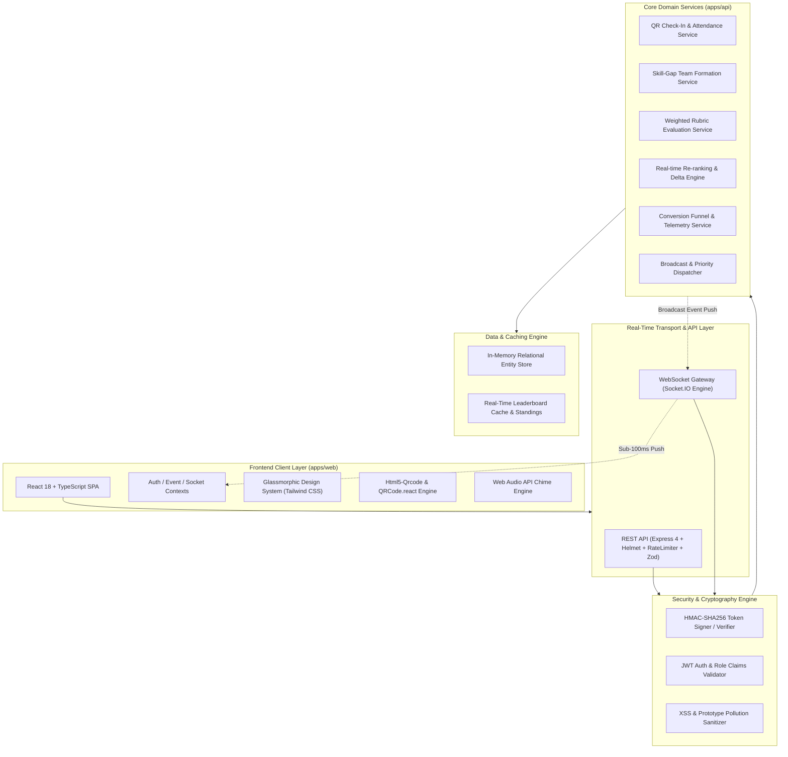

# 🚀 Abhiyantrix | Smart Event Management Platform

[](https://github.com/vasanth-07-bunny/hack-it/actions)
[](https://hac-it.netlify.app/)
[](https://www.typescriptlang.org/)
[](https://reactjs.org/)
[](https://nodejs.org/)
[](SECURITY.md)
[](LICENSE)

> **A unified, real-time event management platform built for hackathons, tech fests, and multi-track conferences.**
> Consolidates the complete event lifecycle — **Registration & Cryptographic QR Check-In, Smart Team Matchmaking, Broadcast Announcements, Weighted Judging Rubrics, Dynamic Real-Time Leaderboards, and Executive Analytics** — into a high-performance interactive dashboard.

🌐 **Live Deployed Application:** [https://hac-it.netlify.app/](https://hac-it.netlify.app/)  
📂 **Public GitHub Repository:** [https://github.com/vasanth-07-bunny/hack-it](https://github.com/vasanth-07-bunny/hack-it)  
💼 **LinkedIn Showcase:** [View Announcement Post](https://www.linkedin.com/posts/chatakonda-vasanth-367aa038a_abhiyantrix-smart-event-hackathon-platform-activity-74994086347587)

---

## 🌟 Key Platform Capabilities

| Module | Core Features | Security & Tech Highlights |
|:---|:---|:---|
| **🎟️ Attendee Pass & Check-In** | • Holographic digital pass<br>• Hardware camera QR scanner<br>• 1-Click rapid dev simulator<br>• Self-serve virtual check-in | • **HMAC-SHA256 Cryptographic Signatures**<br>• Zero-trust tampered token rejection<br>• Duplicate check-in detection (`409 Conflict`) |
| **🤝 Smart Team Matchmaking** | • Skill-gap overlap scoring<br>• Dual-directory (Teams & Unassigned)<br>• 1-Click join requests<br>• Roster locking controls | • Strict max/min team size enforcement<br>• Multi-track filtering (AI, Web3, HealthTech) |
| **📢 Broadcast Center** | • Zero-refresh real-time push<br>• Urgent (`🚨`), Warning (`⚠️`), Info (`📢`)<br>• Web Audio API synthesized chimes<br>• Searchable persistent feed | • WebSocket room partitioning<br>• Input XSS sanitization & Zod validation |
| **⚖️ Interactive Judging Portal** | • Assigned submissions queue<br>• Weighted rubric sliders (0–10)<br>• Structured feedback inputs<br>• Instant score locking | • Deterministic $\sum (\frac{s}{m} \times w \times 100)$ calculation<br>• Organizer evaluation audit trail |
| **🏆 Dynamic Real-Time Leaderboard** | • Top-3 podium with crowns (🥇, 🥈, 🥉)<br>• Rank deltas (`▲ +2`, `▼ -1`, `― 0`)<br>• Criteria score breakdown modals | • Sub-50ms WebSocket push<br>• Technical score tie-breaker algorithm |
| **📊 Executive Analytics** | • Conversion funnel telemetry<br>• Check-in velocity distribution<br>• 1-Click CSV report export | • In-memory high-throughput aggregation<br>• Real-time check-in rate calculations |

---

## 🏛️ System Architecture



---

## 📚 Deliverables & Documentation

- [🏗️ System Architecture & Data Flow](docs/ARCHITECTURE.md)
- [📊 Data Model & Entity Relationship (ER) Diagram](docs/DATA_MODEL.md)
- [🧭 UX Wireframes & Persona User Flows](docs/USER_FLOWS.md)
- [📡 REST API & WebSocket Event Contract](docs/API_CONTRACT.md)
- [🛡️ Enterprise Security Policy & Threat Model](SECURITY.md)

---

## 🚀 Quick Start Guide

### Prerequisites
- [Node.js](https://nodejs.org/) (`v18.0.0` or higher)
- npm (`v9.0.0` or higher)

### 1. Installation

```bash
# Clone the repository
git clone https://github.com/vasanth-07-bunny/hack-it.git
cd abhiyantrix

# Install monorepo dependencies
npm install
```

### 2. Development Mode

```bash
# Run both API (Port 4000) and Web App (Port 5173) simultaneously:
npm run dev

# Or run individually:
npm run dev:api   # Backend API & WebSocket Server
npm run dev:web   # Frontend Vite React App
```

Visit **`http://localhost:5173/`** in your browser.

---

## 🧪 Automated Testing & Verification

Abhiyantrix includes a comprehensive test suite using **Vitest** and **Supertest** covering authentication, cryptographic HMAC check-ins, weighted rubric calculations, team matchmaking, leaderboard re-ranking, and security hardening.

```bash
# Run complete unit & integration test suite
npm run test:api

# Run end-to-end platform verification script
npm run test:e2e

# Run typecheck & production build across all workspaces
npm run build
```

---

## 🔒 Security Hardening

- **Cryptographic Tamper Detection:** HMAC-SHA256 signatures ensure physical and virtual attendee QR tokens cannot be forged or tampered with.
- **Enterprise Middleware:** Protected with `helmet` CSP headers, `express-rate-limit` DDoS mitigations, and prototype-pollution-safe recursive input sanitization.
- **Strict Schema Validation:** All request payloads are strictly validated via **Zod** schemas.
- **Zero Stack Leakage:** Express global error handlers prevent internal implementation details or stack traces from exposing in production.

For detailed security guidelines and vulnerability disclosures, see [SECURITY.md](SECURITY.md).

---

## 📄 License
Distributed under the **MIT License**. See [LICENSE](LICENSE) for more information.
