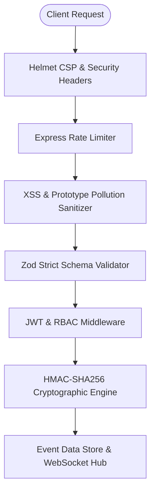

# 🛡️ Abhiyantrix Platform Security & Hardening Policy

## 1. Overview & Threat Model

Abhiyantrix is architected with a **defense-in-depth, zero-trust security model** to safeguard mission-critical hackathon and event operations. The platform guarantees integrity, availability, and privacy across attendee credentials, scoring rubrics, and real-time broadcasts.

---

## 2. Core Security Controls

### A. Cryptographic QR Verification (HMAC-SHA256)
- **Token Format:** `Base64URL(RegistrationID:UserID:EventID:Signature)`
- **Algorithm:** HMAC-SHA256 with key rotation support (`process.env.HMAC_SECRET`).
- **Tamper Protection:** Any client-side or man-in-the-middle modification of the attendee ID, registration ID, or event slug immediately invalidates the signature, returning a strict `400 Bad Request` cryptographic rejection.
- **Replay & Duplicate Check-in Prevention:** Check-in records are atomically verified and committed. Subsequent scans return a `409 Conflict` status with an audit timestamp.

### B. Role-Based Access Control (RBAC) Matrix

| Feature / Action | Anonymous / Public | Participant | Judge | Organizer |
|:---|:---:|:---:|:---:|:---:|
| View Live Leaderboard & Public Events | ✅ | ✅ | ✅ | ✅ |
| Register & Generate Signed QR Pass | ✅ | ✅ | ❌ | ❌ |
| Attendee QR Check-in Verification | ❌ | Virtual Self-Only | ❌ | ✅ Full Admin |
| Team Creation & Matchmaking Joining | ❌ | ✅ | ❌ | ✅ |
| Submit Project Artifacts | ❌ | ✅ (Own Team) | ❌ | ✅ |
| Grade Weighted Rubric Submissions | ❌ | ❌ | ✅ (Assigned) | ✅ |
| Push Broadcast Announcements (WebSocket) | ❌ | ❌ | ❌ | ✅ |
| Manage Event Config & Export CSV | ❌ | ❌ | ❌ | ✅ |

### C. Network & HTTP Hardening
- **Helmet Middleware:** Enforces strict `Content-Security-Policy`, `X-Content-Type-Options: nosniff`, `X-Frame-Options: SAMEORIGIN`, and `Cross-Origin-Resource-Policy`.
- **DDoS & Rate Limiting:**
  - Standard API Routes: 1,000 requests / 15 min per IP.
  - Sensitive Routes (`/login`, `/check-in/verify`, `/judging/scores`, `/register`): 120 requests / 1 min per IP.
- **Input Sanitization:** Recursive object cleaner that strips `<script>` tags, HTML injections, and eliminates prototype pollution keys (`__proto__`, `constructor`, `prototype`).
- **Strict Schema Validation:** All request payloads are strictly validated against strongly-typed Zod schemas before hitting business logic.
- **Zero Stack Leakage:** Express global error handler hides internal traces in non-development environments.

---

## 3. Reporting a Vulnerability

If you discover a potential security vulnerability in Abhiyantrix, please notify the security team responsibly:

1. **Email:** `security@abhiyantrix.io`
2. **Subject:** `[SECURITY DISCLOSURE] Abhiyantrix - <Brief Summary>`
3. **Response Window:** We acknowledge reports within **24 hours** and provide a patch timeline within **72 hours**.
4. Please do **not** disclose the issue publicly until a patch has been released.

---

## 4. Supported Versions

| Version | Supported | Security Patches |
|:---|:---:|:---:|
| `1.0.x` | ✅ Yes | Active |
| `< 1.0.0` | ❌ No | Deprecated |
