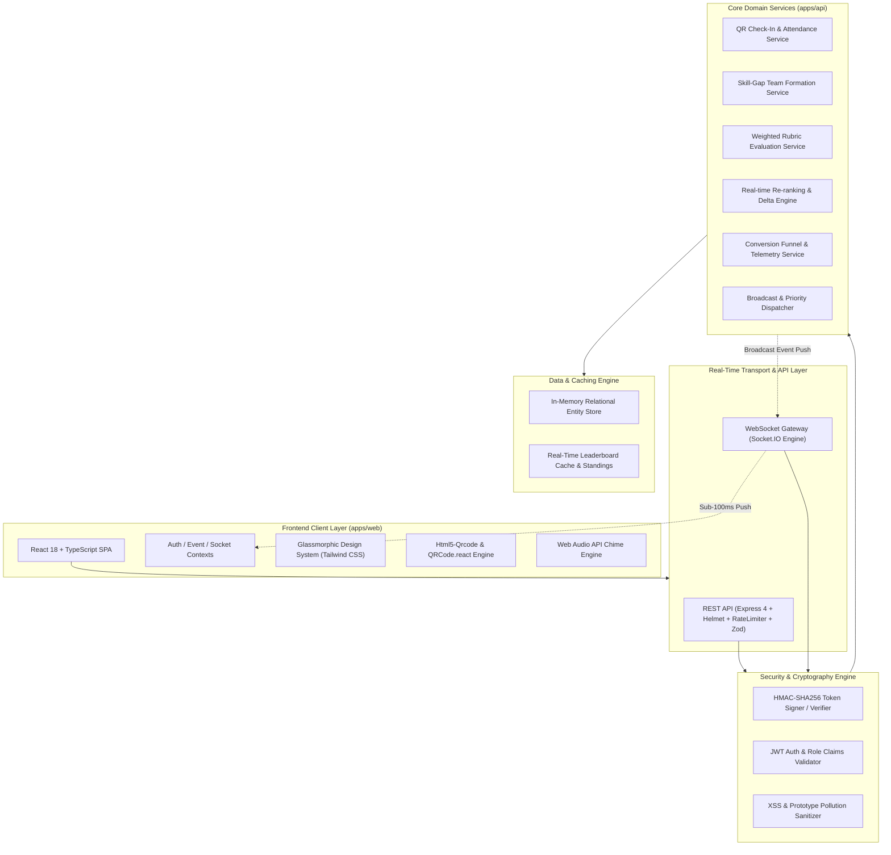
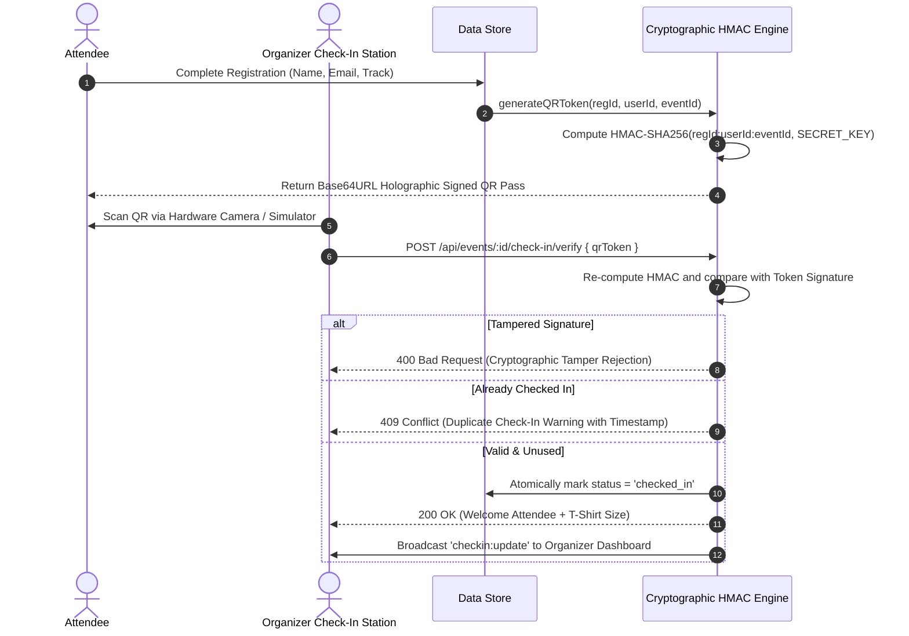

# 🏗️ System Architecture — Abhiyantrix Platform

## 1. High-Level Architecture Overview

Abhiyantrix is built as an event-driven, high-concurrency monorepo architecture engineered for ultra-low latency updates during live hackathons, tech fests, and multi-track conferences.



---

## 2. Real-Time WebSocket Event Pipeline

The platform establishes an active WebSocket connection per client room (partitioned by `eventId`). When state changes occur (such as a score submission or check-in), the service layer processes the update, invalidates the leaderboard cache, recalculates standings, and pushes delta updates to all connected subscribers in `< 50ms`.

```mermaid
sequenceDiagram
    autonumber
    actor Judge as Lead Judge
    participant Web as Judge Portal (Client)
    participant API as Express REST API
    participant Engine as Judging & Scoring Service
    participant Ranker as Dynamic Leaderboard Engine
    participant WS as Socket.IO Server
    actor Participant as Participant / Audience View

    Judge->>Web: Adjust Weighted Rubric Sliders (0-10)
    Judge->>Web: Click 'Submit & Lock Score'
    Web->>API: POST /api/events/:id/judging/scores
    API->>Engine: Validate Zod Schema & Calculate Weighted Total
    Engine->>Ranker: Trigger Leaderboard Recalculation
    Ranker->>Ranker: Sort Scores, Resolve Tie-Breakers, Compute Rank Deltas
    Engine->>WS: Broadcast 'score:submitted' & 'leaderboard:update'
    WS-->>Participant: Real-Time WebSocket Push (0-Refresh)
    Participant->>Participant: Podium Animation & Rank Delta (+2 / -1) Display
    API-->>Web: Return 200 OK + Updated Leaderboard Payload
```

---

## 3. Cryptographic HMAC-SHA256 QR Check-In Flow



---

## 4. Scalability & Resilience Characteristics

1. **Sub-millisecond In-Memory Reads:** Zero disk I/O bottlenecks during live scoring rushes.
2. **Deterministic Tie-Breaking:** Leaderboard rank ties are broken via highest technical score criteria followed by submission timestamp.
3. **Graceful Degradation:** The web client seamlessly falls back to local storage and HTTP polling if WebSocket connectivity experiences edge network drops.
