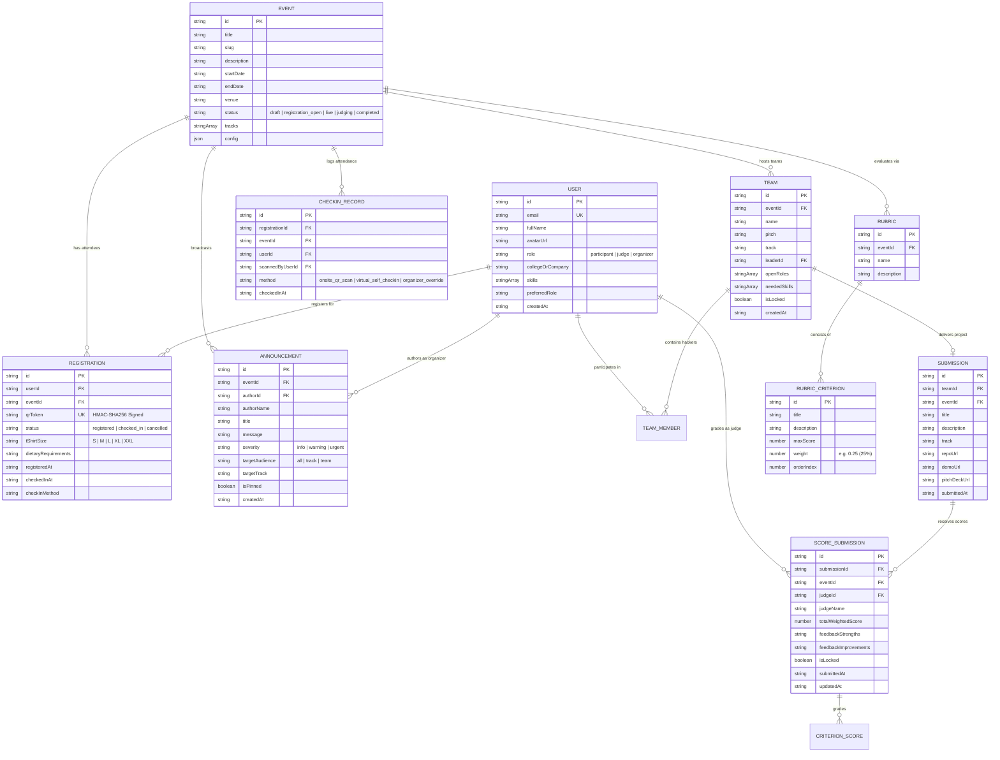

# 📊 Data Model & Entity Relationship (ER) Diagram

## 1. Entity Relationship Diagram (ERD)

---

## 2. Relational Integrity & Normalization

1. **Foreign Key Constraints:** Every `Registration`, `Team`, `Submission`, and `ScoreSubmission` belongs to an existing `Event` and `User`.
2. **Deterministic Cryptographic Tokens:** The `Registration.qrToken` is an immutable, verifiable HMAC digest calculated at registration time.
3. **Atomic Score Calculation:** `ScoreSubmission.totalWeightedScore` is normalized as $\sum (\frac{\text{CriterionScore}}{\text{MaxScore}} \times \text{Weight} \times 100)$, guaranteeing a standard 0–100 scale.
