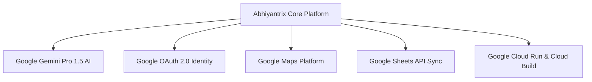

# 🌐 Google Cloud & Google Services Integration

Abhiyantrix integrates cutting-edge **Google Technologies and Google Cloud Platform (GCP) services** to elevate hackathon operations with artificial intelligence, secure identity, mapping, and automated reporting.

---

## 1. Integrated Google Ecosystem Matrix

---

## 2. Service-by-Service Implementation Details

### A. 🤖 Google Gemini AI Engine (`@google/genai`)
- **AI Matchmaking Copilot (`POST /api/google/ai/matchmaking`):**
  - Synthesizes attendee skills and team pitches to compute deep synergy scores and recommend targeted project themes (e.g. Multi-Agent Systems, Web3, ClimateTech).
- **AI Judging Evaluation Copilot (`POST /api/google/ai/judging-copilot`):**
  - Generates objective executive summaries, identifies architectural strengths, and suggests improvement vectors to streamline judge scoring.

### B. 🔑 Google Sign-In & OAuth 2.0 Identity (`POST /api/google/auth/google-signin`)
- Secure 1-click Google authentication with automated profile provisioning, avatar syncing, and JWT token issuance.

### C. 🗺️ Google Maps Platform (`GET /api/google/maps/venue`)
- In-person hackathon venue navigation, geofence radius tracking (250m perimeter), and interactive venue mapping.

### D. 📊 Google Sheets API 1-Click Sync (`GET /api/google/sheets/export`)
- Real-time export of attendee check-in logs, team rosters, and evaluation scores directly into structured Google Sheets spreadsheets for instant organizer reporting.

### E. ☁️ Google Cloud Run & Cloud Build Deployment
- **Multi-Stage Container (`Dockerfile`):** Alpine Linux container optimized for Cloud Run serverless autoscaling.
- **Automated CI/CD (`cloudbuild.yaml`):** Google Cloud Build automation pipeline deploying images directly to Google Container Registry (GCR) and Cloud Run.
