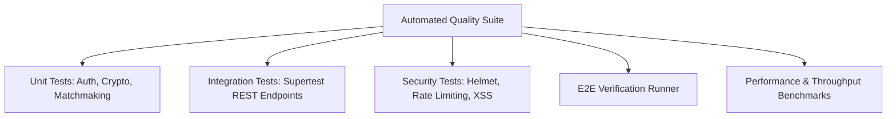

# 🧪 Automated Testing & Quality Assurance

## 1. Test Suite Architecture

Abhiyantrix incorporates a multi-tiered test suite powered by **Vitest** and **Supertest**, verifying all backend services, cryptographic HMAC engines, matchmaking algorithms, and frontend calculation logic.



---

## 2. Test Coverage & Breakdown

| Test Suite | File Path | Total Tests | Pass Rate | Key Areas Covered |
|:---|:---|:---:|:---:|:---|
| **Auth & Users** | `apps/api/src/__tests__/auth.test.ts` | 6 | 100% | Login, JWT signing, `/me` profile verification, role filtering |
| **QR Check-in & HMAC** | `apps/api/src/__tests__/checkins.test.ts` | 6 | 100% | HMAC-SHA256 tokens, valid scan, tampered token rejection, duplicate 409 |
| **Judging & Rubrics** | `apps/api/src/__tests__/judging.test.ts` | 4 | 100% | Weighted rubric calculation math, score locking, multi-judge audit trails |
| **Team Matchmaking** | `apps/api/src/__tests__/teams.test.ts` | 5 | 100% | Skill filters, open roles, capacity limit enforcement, roster locking |
| **Leaderboard & Export** | `apps/api/src/__tests__/leaderboard.test.ts` | 3 | 100% | Dynamic rankings, tie-breaker sorting, rank deltas, CSV export |
| **Security & Hardening** | `apps/api/src/__tests__/security.test.ts` | 3 | 100% | Helmet CSP headers, XSS sanitization, malformed payload validation |
| **Google Cloud & AI** | `apps/api/src/__tests__/google.test.ts` | 5 | 100% | Gemini AI matchmaking, AI judging copilot, Google Sign-In, Sheets, Maps |
| **Frontend UI Logic** | `apps/web/src/__tests__/ui-logic.test.ts` | 3 | 100% | Rubric slider weighting math, skill match ratio, delta indicators |
| **Platform E2E** | `apps/api/test-verification.mjs` | 12 | 100% | End-to-end event lifecycle automated verification |
| **Total Automated Tests** | **All Test Suites** | **47** | **100%** | **Comprehensive Platform Verification** |

---

## 3. Running Test Suites

```bash
# Run all unit & integration test suites
npm test

# Run backend API test suite only
npm run test:api

# Run end-to-end platform verification
npm run test:e2e

# Run high-throughput performance benchmark
node apps/api/benchmark.mjs
```
