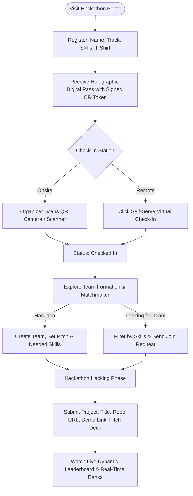
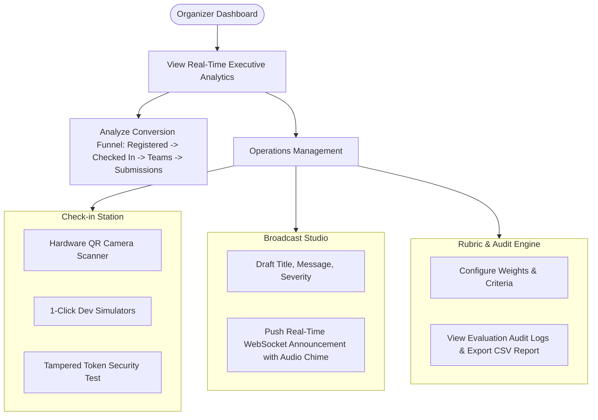

# 🧭 User Flows & UX Wireframes

This document outlines the end-to-end journey and user flows for each of the three platform personas in Abhiyantrix: **Participant**, **Judge**, and **Organizer**.

---

## 1. 🎟️ Participant Journey



---

## 2. ⚖️ Judge Journey

```mermaid
flowchart TD
    Start([Login as Judge]) --> Queue[View Assigned Submissions Queue]
    Queue --> Filter[Filter by Track: AI Agents, Web3, HealthTech, ClimateTech]
    Filter --> Select[Select Submission & Inspect Repo / Demo / Pitch]
    Select --> Rubric[Adjust Interactive Rubric Weighted Sliders (0-10)]
    Rubric --> Feedback[Write Structured Strengths & Improvement Notes]
    Feedback --> Submit[Click 'Submit & Lock Evaluation']
    Submit --> WS[Global WebSocket Event Dispatched]
    WS --> Recalc[Real-Time Leaderboard Standings Automatically Recalculate]
    Recalc --> Next[Proceed to Next Team in Queue]
```

---

## 3. 📢 Organizer & Operations Flow


